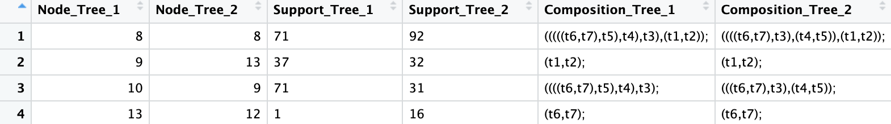
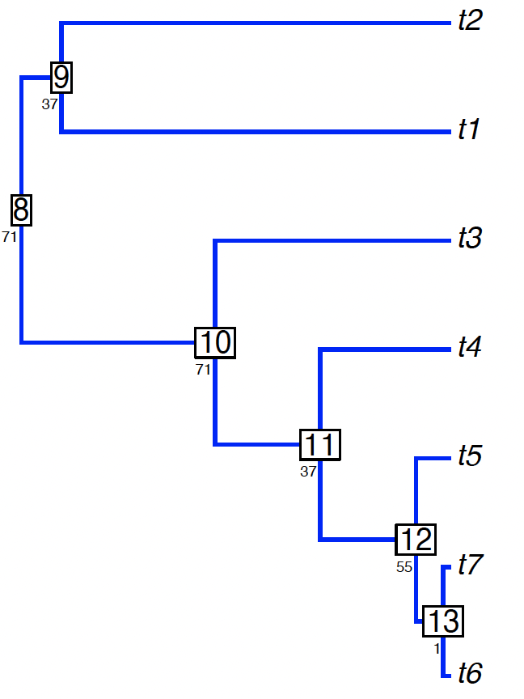
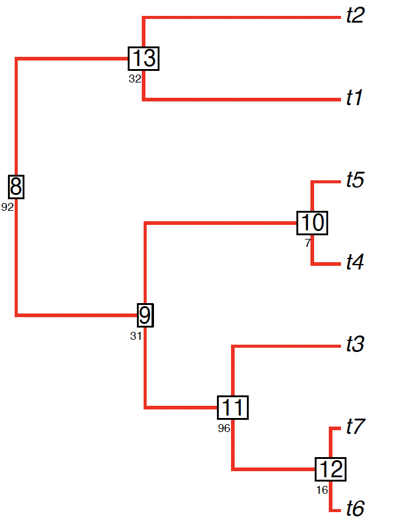
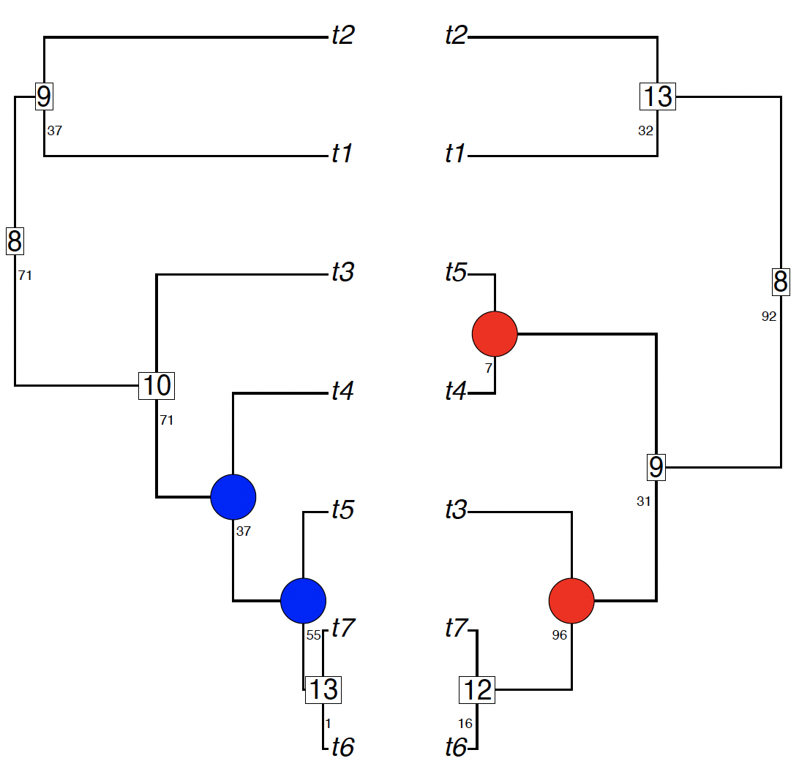
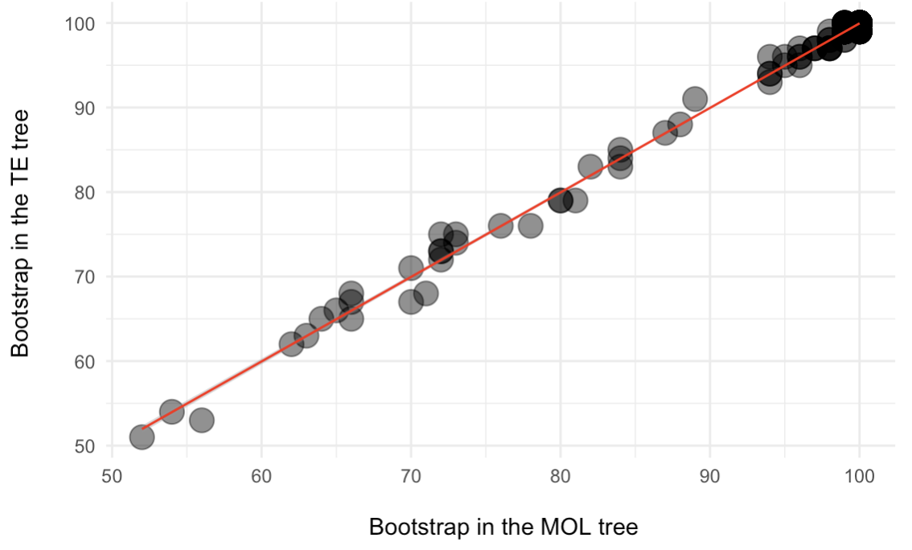
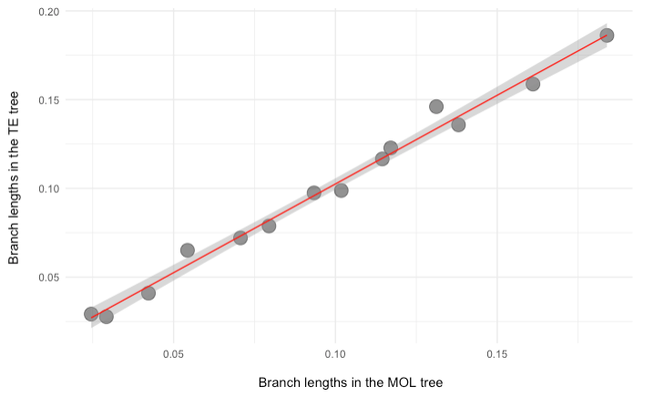

# RNODE: Comparisons of topologies and support between phylogenetic trees

[](https://www.r-project.org)
[](https://scholar.google.com/citations?user=c0W8Cm8AAAAJ&hl=en)
[](https://www.gnu.org/licenses/gpl-3.0.html)

**RNODE** is an R package to facilitate pre- and postprocessing of phylogenetic analyses, including (1) comparisons of topologies, branch lengths, support values, (2) comparison of DNA sequences, (3) manipulation of cladistic matrices, and (4) manipulation of trees.

Copyright (C) Daniel Y. M. Nakamura 2025

## Installation

**RNODE** can be installed with the following command:

```
devtools::install_github("danimelsz/RNODE")
```

**RNODE** was tested in R. v. 4.2.2. Dependencies are expected to be automatically installed. Alternatively, try to install manually *ape*, *dendextend*, *phangorn*, *phytools*, *stringr*, *TreeDist*, and *TreeTools*.

## Usage

The following functions are available in **RNODE**:

| Function                  | Description |
|:--------------------------|:------------|
| *sharedNodes*             | Given two input trees, compare shared clades. The output is (1) basic statistics about number of shared clades and support values; (2) a dataframe with node labels, descendants, and support values of shared clades, which facilitates descriptive and statistical comparisons of clade composition and support between corresponding nodes.  |
| *uniqueNodes*             | Given two input trees, identify unique clades. The output is two lists containing unique clades and support values in each tree.  |
| *retrodictNodes*          | Given two input trees, create a dataframe containing support values of one tree and clade occurrence  of another tree. |
| *compareBranchLength*             | Given two input trees, compare branch lengths of internal edges (shared clades) and terminal edges (shared leaves). The output is a dataframe with node labels and branch lenghs.  |
| *normalizedSPR*           | Given two binary trees, compute the normalized SPR distance, following Ding et al. (2011). |
| *multiSPR*                | Given two sets of binary trees (e.g. MPTs), compute (normalized) SPR distances between two randomly selected trees or between all pairs of trees (summarized as mean or minimum values). |
| *summaryTopologicalDist*  | Given two sets of trees, compute the number of shared clades, number of unique clades in each tree, Robinson-Foulds, and Cluster Information distance.  |
| *filterMissing*           | Given a matrix (.nex or .tnt), delete taxa and/or characters containing only missing data (?). |
| *splitOrdFromUnord*       | Given a morphological matrix (.nex or .tnt) and a list of ordered and unordered characters, split the matrix into two matrices. |
| *mapSupport*              | Given one tree with support values (e.g. majority consensus of bootstrap trees) and another tree without support values (e.g. strict consensus of optimal trees), map the support values from the former to the latter. |

The following examples are designed for users with little experience. If you have questions, send a message using GitHub issues. 

### Example 1: Tree comparisons

#### Example 1.1 Identify shared and unique clades

Using simple simulations, we can demonstrate how to compare support values between trees. We first simulate two trees containing support values: 

```
set.seed(44)
# Simulate tree a
a = pbtree(n=7) 
# Generate random support values as integers to tree a
node_labels = sample(1:100, a$Nnode, replace = TRUE) 
# Add the support values as node labels to tree a
a$node.label = node_labels 

set.seed(88)
# Simulate tree b
b = pbtree(n=7)
# Generate random support values as integers to tree b
node_labels = sample(1:100, b$Nnode, replace = TRUE) 
# Add the support values as node labels to tree b
b$node.label = node_labels 
```

Next, we run *sharedNodes* to identify matching clades and their descendants and support values. Additionally, we also can plot the trees.

```
# Compare shared clades and support values (and plot)
df = sharedNodes(tree1=a, tree2=b, composition=T, 
                 plotTrees = T,
                 output.tree1="example1.1_simulated1.pdf",
                 output.tree2="example1.1_simulated2.pdf", 
                 tree.width = 3, # adjust tree width
                 tree.height = 4, # adjust tree height
                 tree.fsize = 1, # adjust font size
                 tree.adj=c(1.2,3), # adjust support position
                 tree.cex=.5, # adjust support size
                 node.numbers=T) # show node index
```

<p align="center">
  <a href="tutorial/example1.1_df.png"></a>
</p>


<p align="center">
  <a href="tutorial/example1.1_simulated1.png"></a>
  <a href="tutorial/example1.1_simulated2.png"></a>
</p>

Alternatively, we can identify and plot the unique clades:

```
uniqueNodes(a, b, composition=T, dataframe=T,
            plotTrees=T, output.tree = "example1.1_unique.pdf",
            node.numbers=T, 
            tree.fsize=2, # adjust text size
            tree.cex=7.5, # adjust circle size
            sup.adj1=c(-.2,4), # adjust support from tree a
            sup.adj2=c(1.3,4) # adjust support from tree b
            )
```

<p align="center">
  <a href="tutorial/example1.1_unique.png"></a>
</p>

#### Example 1.2 Support comparisons

We can use *sharedNodes* to compare two empirical trees in .nwk format estimated in TNT. Polytomies and input trees with different taxon samples are accepted but names of corresponding leaves should be equal in the input trees. For instance, using the data set from Whitcher et al. (2025), we can plot the relationship of bootstrap values between molecular (MOL) and total evidence (TE) trees analyzed in TNT.

```
# Load trees
MOL = read.tree("../testdata/051b_MOL_BS_TNT.nwk")
TE = read.tree("../testdata/051d_TE_BS_TNT.nwk")

# Run sharedNodes
df = sharedNodes(tree1=MOL, tree2=TE, spearman = T)

# Plot the relationship of support between trees
ggplot(df, aes(as.numeric(Support_Tree_1), as.numeric(Support_Tree_2))) +
  geom_point(size = 5, show.legend = F, alpha=.5) +
  theme_minimal() + 
  geom_smooth(method = "lm", se = T, color = "red", linewidth = .5) +
  labs(x="\n Bootstrap in the MOL tree",
       y="Bootstrap in the TE tree \n")
```

<p align="center">
  <a href="tutorial/example1.2_correlation.png"></a>
</p>

As expected, there is a significant correlation between bootstrap values of MOL and TE trees (Spearman: rho = 0.89; P < 0.001). 

#### Example 1.3 Logistic regressions

If the user wants to test if support values of one tree predict the occurrence of clades in another tree, the function **retrodictNodes** creates a dataframe containing support values of tree 1 and the occurrence of the clade in tree 2, which can be used for logistic regressions.

```
# Load trees
MOL = read.tree("../testdata/001_MOL_IQTREE.contree")
TE = read.tree("../testdata/001_TE_ASC_IQTREE.contree")

# Run retrodictNodes
df = retrodictNodes(MOL, TE)
df$occurrence_tree2 = as.factor(df$occurrence_tree2)

# Fit the logistic regression
model <- glm(occurrence_tree2 ~ support_tree1, data = df, family = binomial)
summary(model)

# Convert log-odds to odd ratios
exp(coef(model))
```

Using the data set from Janssens et al. (2018), the logistic regression revealed an intercept of 0.009 (i.e. when bootstrap is 0 in the first tree, the odds of presence of the clade in the second tree is 0.009; P < 0.01). Furthermore, for every one-unit increase in bootstrap in the first tree, the odds of presence of the clade in the second tree increase by 1.075 (7.5%). 

#### Example 1.4 Branch length comparisons

In addition to descendants and support values, branch lengths can be compared. Here we used two simple simulated examples.

```
# Read trees
mol = read.tree("../testdata/003_MOL_IQTREE.contree")
te = read.tree("../testdata/003_TE_ASC_IQTREE.contree")

# Compare branch lengths
RNODE::compareBranchLength(tree1, tree2, composition=T)

# Correlation between branch lengths
summary(lm(data=df, formula=EdgeLength_tree1 ~ EdgeLength_tree2))

# Plot 
ggplot(df, aes(as.numeric(EdgeLength_tree1), as.numeric(EdgeLength_tree2))) +
  geom_point(size = 5, show.legend = F, alpha=.5) +
  theme_minimal() + 
  geom_smooth(method = "lm", se = T, color = "red", linewidth = .5) +
  labs(x="\n Branch lengths in the MOL tree",
       y="Branch lengths in the TE tree \n")
```

<p align="center">
  <a href="tutorial/example1.4.png"></a>
</p>

#### Example 1.5 Topological distances

### Example 2 Comparison of DNA sequences

### Example 3 Matrix manipulation

### Example 4 Tree manipulation


## Cite

If you use **RNODE**, please cite this repository.
